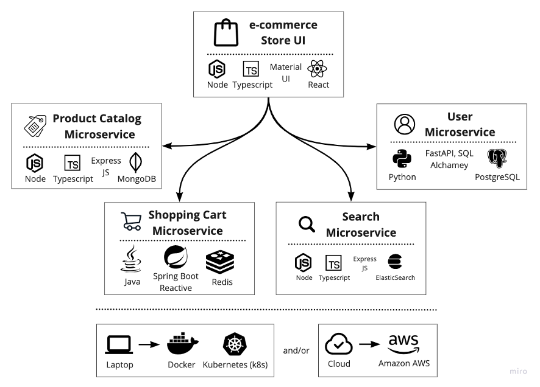
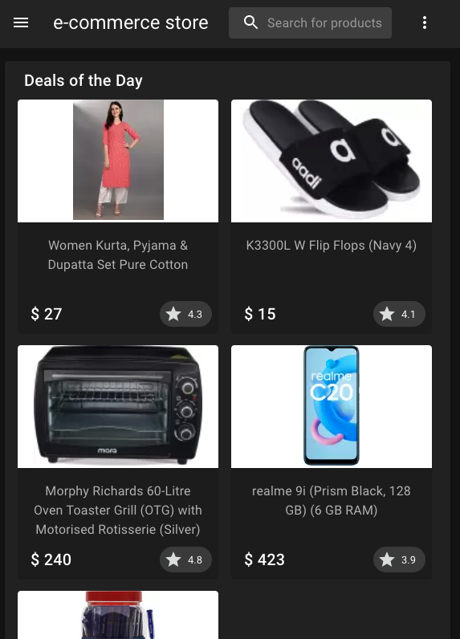

# Sample E-Commerce application using Microservices / Cloud Native Architecture (CNA)
**_A fictitious e-commerce sample application built using modern technologies and  Microservices & Cloud Native Architecture patterns._**
- **Polyglot Languages & Frameworks** (Java - Spring Boot/Cloud, Python - FastAPI, SQLAlachamey, JavaScript/TypeScript - Node, ExpressJS, React)
- **Polyglot Databases** (MongoDB, Redis, ElastiSearch, PostgreSQL)
- Able to deploy to **local Kubernetes (k8s) cluster** as containers (Docker) and also to **Public Cloud (AWS)**.

This is an end-to-end **e-commerce solution** that demonstrates how to build a moder CNA application using microservices architecture with full-stack technologies. This application includes below functional microservices which are independently deployable with bounded context.

_You can standup application locally on your laptop/desktop with few steps and also to AWS._

## App -  UI/UX, Architecture & Technologies Used

Architecture         |  Application UI/UX
:-------------------------:|:-------------------------:
 |  

## Functional Microservices
| Microservice  | Description | Technologies Used |
| --- | --- | --- |
| [Product Catalog Microservice](products-cna-microservice/README.md) | Provides e-commerce merchandise information and images. | A REST API built using NodeJS, ExpressJS relies MongoDB as a data store. | 
| [Shopping Cart Microservice](cart-cna-microservice/README.md) |  A Microservice with shopping cart and checkout features. | A REST API built using Spring Boot & Cloud with Gradle as build tool, leverages Redis as in-memory data store. |
| [User Profile Microservice](users-cna-microservice/README.md) | User profile management, account and more. | A REST API built using Python FastAPI and SQLAlchamey used PostreSQL   |
| [Search Microservice](search-cna-microservice/README.md) | Enables seach functionality such as auto complete, typeahead, faceted search features | A proxy to ElasticSearch, leverages Node|
| [Store UI](store-ui/README.md) | A web UI frontend for e-commerce store that uses above Microservices | A web app built using React, Material UI using TypeScript/JavaScript|

## Folder Structure
```bash
.
├── store-ui                    # Web Store Ract App with Material UI
│   └── ...
├── cart-cna-microservice       # Shopping Cart Microservice repository
├── products-cna-microservice   # Product Catalog Microservice folder
├── search-cna-microservice     # Search Microservice
├── users-cna-microservice      # User Profile Management Microservice
├── users-cna-microservice      # User Profile Management Microservice
├── store-ui                    # Web Store Ract App with Material UI
└── infra                       # Infrastructure scripts to setup app locally & cloud
    ├── k8s                     # Kubernetes (k8s) YAML files
    │    └── apps               # Microservices related k8s yaml files.
    │    └── shared-services    # Databases, ElasticSeach related k8s yaml files.
    ├── terraform               # Terraform scripts to deploy to AWS
    └── performance             # Performance and load testing scripts
```

## Getting Started

### Build
Go through detailed instructions specified in README.md file of each microservice.

### Deploy
Refer to [instructions](infra/README.md) to deploy application and dependent services such as MongoDB, Redis, ... either to local machine or AWS.

## Issues & Feedback
Raise an issue in Github. Will address as soon as possible.
